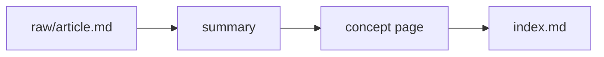

# Wiki structure, naming, and writing conventions

## The directory tree

```
<wiki-root>/
├── CLAUDE.md
├── .kbw/
│   ├── config.yaml
│   └── log/YYYYMMDD.md
├── raw/
│   ├── articles/        # web articles, blog posts
│   ├── papers/          # academic papers (PDF → .md extracted)
│   ├── notes/           # user-authored notes, transcripts
│   ├── inbox/           # drop zone — reconciled on next ingest
│   └── refs/            # pointer files for large external binaries
├── wiki/
│   ├── index.md         # master catalog
│   ├── concepts/        # topic pages
│   ├── entities/        # people, tools, papers, orgs
│   ├── summaries/       # one per raw/ source
│   └── themes/          # cross-cutting patterns (≥2 concepts/drafts) — agent surfaces proactively
└── outputs/
    └── queries/         # Q&A answers; promote durable ones into wiki/
```

## Naming

- **Pages**: human-readable, hyphenated or Title_Case. Example: `wiki/concepts/transformer-scaling.md` or `wiki/entities/Andrej_Karpathy.md`. Pick one style per wiki and put it in `CLAUDE.md`.
- **Summaries**: `wiki/summaries/<slug>.md` where `<slug>` matches the raw file (e.g. `raw/articles/karpathy-llm-wiki.md` → `wiki/summaries/karpathy-llm-wiki.md`).
- **Themes**: `wiki/themes/<pattern-name>.md`. Name the pattern, not the example (`the-partitioning-thesis.md`, not `tool-vs-runtime.md`). Themes generalize; concept pages are specific.
- **Folder-split concepts**: when a topic exceeds 1200 words, become a subfolder: `wiki/concepts/<topic>/index.md` + `wiki/concepts/<topic>/<aspect>.md` per aspect.

## Themes — the cross-cutting category

`wiki/themes/` holds pages about **patterns that recur across ≥2 concepts, drafts, or summaries**. They're the connective tissue of a body of work: the same argument repeated at different layers, the same opposition surfacing in unrelated posts, a stylistic move that turns out to be the author's signature.

A theme page is not a concept. A concept is *"the specific post I'm going to write."* A theme is *"the pattern that several of my posts share."* They serve different layers of the user's thinking.

**Entry shape** (minimum viable):

```markdown
# Theme — <Pattern Name>

**Pattern**: One paragraph naming the cross-cutting pattern in the author's voice.

**First noticed**: <date>, while <doing what>.

## Instances
- [[concept-or-draft-A]] — how this exemplifies the pattern
- [[concept-or-draft-B]] — ...

## Why this is the user's stance, not generic industry observation
What makes the cross-instance consistency a *unique-author signal*.

## Potential meta-post
- Working titles
- Why it might / might not work as its own essay
- Status: idea / researching / drafting / shelved / un-meta

## Tracking new instances
Watch-list for future drafts that may add rows to Instances. Don't fork into a second theme — extend this one.

## Related
- [[sibling-theme]] · [[parent-theme]]
```

**Trigger rules** (the agent applies these at step 8 of `ingest` and step 6 of `compile`):

- Catching yourself writing *"this connects to [[X]] and [[Y]]"* in two separate concept pages → theme.
- Same opposition phrased differently in three drafts → theme.
- A user comment landing twice on the same observation → theme.
- A voice signature doing strategic work in multiple posts → theme (this one stays *un-meta* — see "Honest disclaim" pattern from the content-research wiki).

**When NOT to write a theme**:

- One-off observation (no second instance yet) → leave as an open-question bullet on the noticing concept page; promote later.
- Generic industry observation the user happens to have made once → not a theme; just a fact.
- Vague vibe with no named pattern → not yet; wait until you can name it.

## Divide and conquer

Target 400–1200 words per concept page. Past 1200, **split**:

```
Before                                  After
wiki/concepts/transformers.md           wiki/concepts/transformers/
                                          ├── index.md             # overview + links to sub-pages
                                          ├── attention.md
                                          ├── positional-encoding.md
                                          ├── tokenization.md
                                          └── scaling-laws.md
```

The `index.md` is short — a definition, a list of sub-pages with 1-line summaries, and any cross-links. Each aspect file is independently linkable and stands alone.

`wiki/index.md` shows the hierarchy via indented bullets:

```markdown
### Concepts
- [[concepts/Transformers/index|Transformers]] — base architecture for modern LLMs
    - [[concepts/Transformers/attention]] — scaled dot-product attention
    - [[concepts/Transformers/positional-encoding]] — sinusoidal vs RoPE vs ALiBi
    - [[concepts/Transformers/tokenization]] — BPE, SentencePiece, byte fallback
    - [[concepts/Transformers/scaling-laws]] — Chinchilla, Hoffmann et al.
```

## Wikilinks

- Inline references: `[[Target Page]]`. The display text equals the filename basename without extension (or with `|alias` to override).
- `lint_wiki.py` checks every `[[X]]` against the filesystem and reports dead links.
- `ki`'s ingest folds wikilink display text into the target doc's aliases, so `[[Darth Vader|Anakin]]` makes "Anakin" searchable.

## Mermaid for diagrams, KaTeX for math

**ASCII art rots. Use mermaid for any flow, sequence, hierarchy, or state diagram.**

````markdown

````

For math, use KaTeX delimiters: `$inline$` and `$$block$$`.

Both render in Obsidian with default settings, in GitHub's markdown viewer, and in most static-site generators.

## Large binaries — never in `raw/`, never as a symlink

Anything over ~10 MB (videos, model weights, large PDFs, datasets) lives outside the wiki. **Never symlink them in.** Symlinks fail in three predictable ways:

- Cloud-sync (Drive, Dropbox, iCloud) handles them inconsistently and often de-links on sync.
- `ki index` may follow them and ingest out-of-tree content with confusing URIs.
- Moving the wiki to another machine breaks the link silently.

Instead, create a pointer file at `raw/refs/<slug>.md`:

```markdown
---
kind: ref
external_path: /Volumes/external/models/llama-3-70b/
size: ~140 GB
sha256: <if you care about provenance>
added: 2026-05-21
---

# Llama 3 70B weights

What it is, why it matters to this wiki, how to access it.
```

Wiki pages cite `[[raw/refs/<slug>]]` exactly like any other source. This keeps the wiki git-friendly, portable, and small enough to live happily on Drive/Dropbox sync.

## `wiki/index.md` format

```markdown
# Index — <Topic>

> One-sentence scope of the wiki.

## 🔖 Navigation
- [[#Concepts]] · [[#Entities]] · [[#Summaries]] · [[#Themes]] · [[#Open Questions]]

## Concepts

### <Category A>
- [[concepts/Foo]] — one-line summary
- [[concepts/Bar/index|Bar]] — (folder-split) one-line summary
    - [[concepts/Bar/aspect-1]] — ...
    - [[concepts/Bar/aspect-2]] — ...

### <Category B>
- ...

## Entities
- [[entities/Andrej Karpathy]] — AI researcher, author of the llm-wiki pattern

## Summaries (chronological)
- 2026-04-09 — [[summaries/llm-wiki-gist]] — Karpathy's original Gist

## Themes
- [[themes/<pattern-name>]] — cross-cutting pattern across ≥2 concepts/drafts

## Open Questions
- Q1: ...
```

Rules:

- Every wiki page appears exactly once in `index.md`. `lint_wiki.py` enforces this.
- Folder-split concepts show hierarchy via indented bullets.
- Chronological order in **Summaries** reflects ingest date.
- **Open Questions** mirrors the same section in `CLAUDE.md`.

## `.kbw/log/YYYYMMDD.md` format

One file per day. Each op appends an h2 with timestamp:

```markdown
# 2026-05-21

## [09:14] ingest | karpathy-llm-wiki — Karpathy's LLM Knowledge Bases post (touched 4 pages)
## [11:02] query | wiki-vs-rag-tradeoffs
## [11:18] promote | wiki-vs-rag → wiki/concepts/wiki-vs-rag.md
## [16:30] lint | 3 issues found, 3 fixed
```

Quick grep across history: `grep -rh "^## \[" .kbw/log/ | tail -20`.
